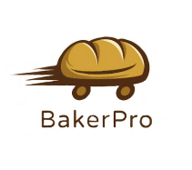
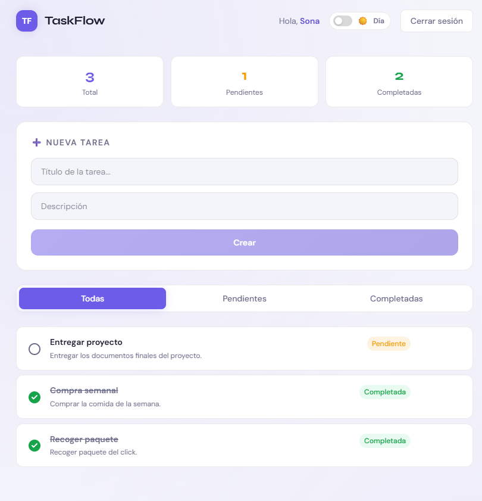
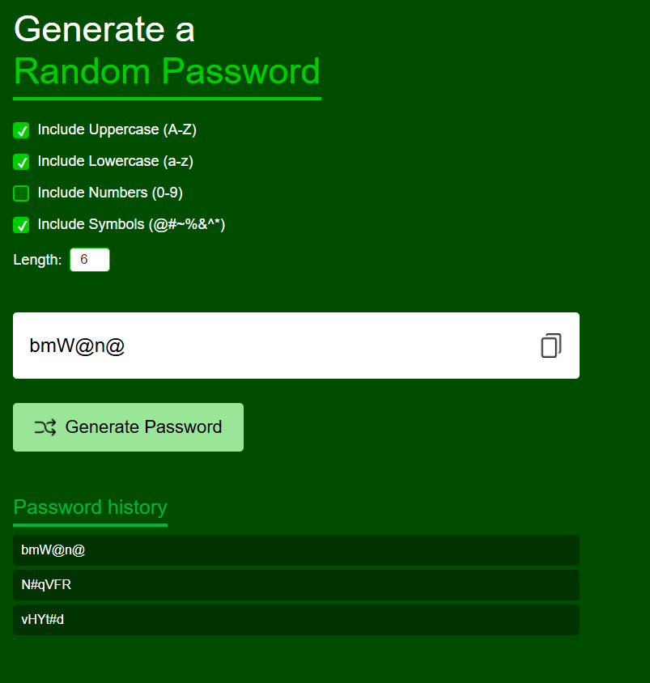

# Sona Ivanyan
**`Software Developer`** 

## 👩‍💻 About Me
- 💻 Software developer passionate about building scalable applications
- 🚀 Interested in **Backend Development and System Design**
- 📚 Continuously learning about software architecture and best practices

## 🛠 Skill stack
<!-- Skill icons provided by skill-icons. Full icon list and names:
     https://github.com/tandpfun/skill-icons?tab=readme-ov-file#icons-list -->

**Also comfortable with**: DB (MongoDB, Postgres, MySQL), API (Postman), Deployment (Vercel, Railway).

---

## 🚀 Featured Projects

<table>
  <tr>
    <td align="center" width="33%">
      
       
      <b>🍞 BakerPro App</b> 
      Built an LLM-powered chatbot that answers domain-specific questions in real time. 
      🔗 <a href="https://github.com/sonaDevLab/BakerPro">Repo</a>
       
      Tags: AI, LLMs, Prompt Engineering
    </td>
    <td align="center" width="33%">
      
       
      <b>📌 TaskFlow API</b> 
      Automated deployment of a web app using GitHub Actions and AWS ECS. 
      🔗 <a href="https://github.com/sonaDevLab/TaskFlow">Repo</a>
       
      Tags: DevOps, Docker, GitHub Actions
    </td>
    <td align="center" width="33%">
      
       
      <b>🔐 Password Generator</b> 
      Built an LLM-powered chatbot that answers domain-specific questions in real time. 
      🔗 <a href="https://github.com/sonaDevLab/PasswordGenerator">Repo</a>
       
      Tags: AI, LLMs, Prompt Engineering
    </td>
  </tr>
</table>

---

## 📊 Stats
<!-- Stats card by anuraghazra/github-readme-stats
     Customization guide:
     - Hide private contributions: &count_private=true|false
     - Theme list: ?theme=gruvbox,radical,tokyonight,onedark,dracula etc.
     - Show icons: &show_icons=true
     Docs: https://github.com/anuraghazra/github-readme-stats -->

  
  &nbsp;&nbsp;&nbsp;&nbsp;
  

---

## 📫 Links
<!-- Section layout inspired by Awesome GitHub Profile README "Descriptive" patterns:
     https://github.com/abhisheknaiidu/awesome-github-profile-readme?tab=readme-ov-file#descriptive- -->
- [**Portfolio**]()
- [**Contact**](mailto:sonaivanyan@gmail.com)

